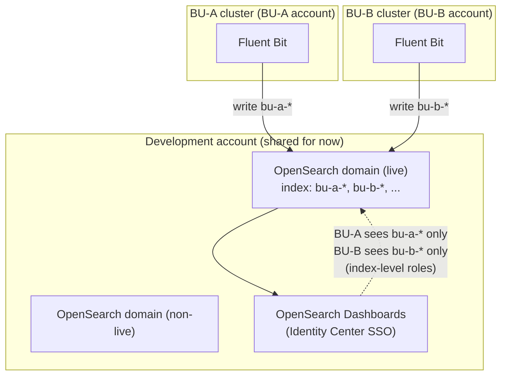
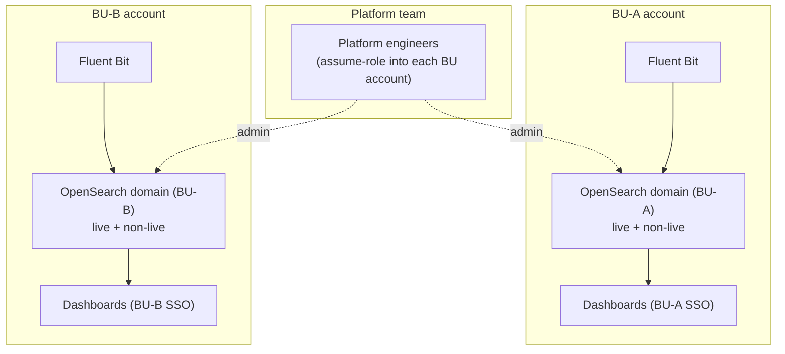
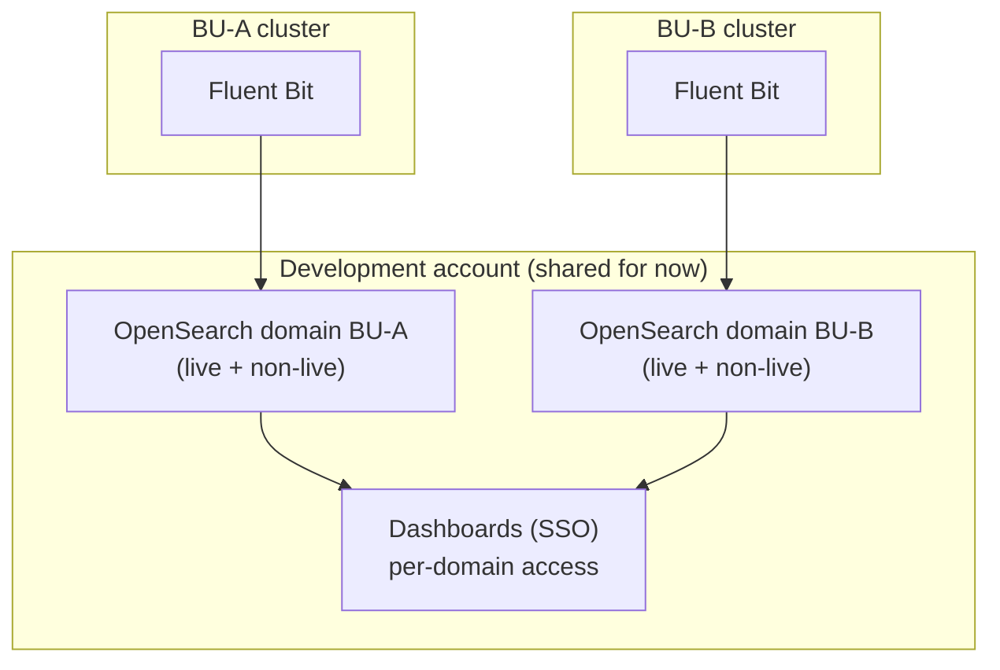

# ADR-017: OpenSearch Deployment Model

**Status:** Proposed — PoC in progress (#8420)
**Parent:** [ADR-017: Logging and Log Management Architecture](ADR-017-logging-and-log-management.md)
**Related ticket:** [cloud-platform#8420](https://github.com/ministryofjustice/cloud-platform/issues/8420) (child of #8415)
**Category:** Observability / Logging

---

## Purpose

ADR-017 picks OpenSearch for full-text log search and leaves the deployment model to a PoC.
This page is the record for that PoC: the decisions made, the questions still open, and the
evidence behind each. It is a **living document** — updated as the PoC runs.

There are two things to decide, plus a cost figure:

1. **Service model** — provisioned domain or OpenSearch Serverless.
2. **Placement** — one shared cluster, or one per business unit (BU).
3. **Cost** at full scale, against today's ~$54k/month.

Out of scope: the Cortex XSIAM / SOC forwarding path (a separate concern on the S3 side).

---

## PoC options

Three ways to place OpenSearch across the BUs. Diagrams for each are below.

| Option | What it is | Isolation | Ops effort | Main trade-off |
|---|---|---|---|---|
| **A — Shared cluster, per-BU index** | One OpenSearch cluster for everyone. Each BU's logs go into its own index, and each BU can only see its own. Like one filing cabinet with a locked drawer per team. | Logical (index-level roles) | Lowest — one cluster | Noisy neighbour: one BU can slow others |
| **B — Cluster per BU, in BU accounts** | Each BU gets its own OpenSearch cluster, living in that BU's own AWS account. Teams are fully separate — own cluster, own account. | Physical (account boundary) | Highest — 8–9 clusters across accounts | Most to run and manage |
| **C — Cluster per BU, one account** | Each BU gets its own cluster, but they all sit in one shared account. Separate clusters, one place to manage them. | Physical (cluster boundary) | High — 8–9 clusters | Middle ground |

**In short:**

- **A** is the cheapest to run and matches how we already do Grafana. The risk is noisy
  neighbour — one BU's load affecting others. Because this is read-only log viewing, that
  risk is easier to accept.
- **B** and **C** remove noisy neighbour by giving each BU its own cluster, but cost 8–9× the
  clusters to run.
- **Cost is not the deciding factor** — the split barely changes total cost (see Q1a). The
  real choice is isolation vs how much we want to operate.

**Starting point to discuss:** Option A, with noisy neighbour as the risk to watch. Move to
per-BU only if a BU proves disruptive or account ownership requires it.

### Diagrams

Draft sketches for review — the final AWS-icon diagram is added once the model is chosen.
All apply the live/non-live split (D7).

**Option A — one shared cluster, per-BU indexes**

Every BU's Fluent Bit writes into one shared OpenSearch cluster, each to its own index
(`bu-a-*`, `bu-b-*`). In Dashboards, index-level roles mean a BU can only see its own logs.
One cluster to run, but the BUs share the same compute — so a heavy BU can slow the rest.

| Pros | Cons |
|---|---|
| Cheapest to run — one cluster | Noisy neighbour: one BU can slow others |
| Least to manage and patch | Isolation is logical, not physical |
| Matches how we do Grafana today | Cross-account access to reach the shared cluster |
| Simple, single place to search | One cluster down = everyone down |

**Option B — one cluster per BU, in each BU's account**

Each BU has its own OpenSearch cluster inside its own AWS account. Fluent Bit writes locally,
and access is bounded by the account itself. Full separation, so no noisy neighbour — but the
platform team must reach into each account (assume-role) to manage 8–9 clusters.

| Pros | Cons |
|---|---|
| Strongest isolation — account boundary | Most to run: 8–9 clusters across accounts |
| No noisy neighbour | Platform team assume-roles into each account |
| Fits "BU resources in BU accounts" | Highest ops and patching effort |
| One BU's outage stays with that BU | Fluent Bit writes are same-account (simple), but harder to see everything in one place |

**Option C — one cluster per BU, all in one account**

Each BU still gets its own cluster, so there's no noisy neighbour — but all the clusters sit
in one shared account. Separate clusters keep the BUs apart; the single account keeps them in
one place to manage. Still 8–9 clusters to run, but no cross-account hop.

| Pros | Cons |
|---|---|
| No noisy neighbour — separate clusters | Still 8–9 clusters to run and patch |
| One account to manage them all | Doesn't fit "BU resources in BU accounts" |
| No cross-account hop for the platform team | Cross-account writes from each BU's Fluent Bit |
| Simpler access than per-account (Option B) | More to run than the shared cluster (Option A) |

### B vs C — what's actually different

Both give each BU its own cluster, so both remove noisy neighbour and both mean 8–9 clusters
to run. The only difference is **which account the clusters live in**.

| | Option B (BU accounts) | Option C (one account) |
|---|---|---|
| Where clusters live | Each in its BU's own account | All in one shared account |
| Isolation | Account **and** cluster boundary — strongest | Cluster boundary only |
| Fits "BU resources in BU accounts" | Yes | No |
| Platform team access | Assume-role into each BU account | One account, no hop |
| Fluent Bit writes | Same-account (simple) | Cross-account into the shared account |

In short: **B** is stronger on isolation and fits the BU-owns-its-resources principle, but the
platform team has to hop across accounts to manage it. **C** is easier for the platform team
(one account) but weaker on isolation and doesn't fit that principle.

---

## Decisions made

| # | Decision | Basis | Status |
|---|---|---|---|
| D1 | **Live runs on a provisioned domain.** Serverless is not used for production. | Team decision | Agreed |
| D3 | **One index per BU.** Keeps each BU's data separate and stops one BU affecting another. Per-index cost accepted. | Team decision | Agreed |
| D5 | **Engine version pinned to `OpenSearch_3.7`** (latest in eu-west-2). Always pin versions — don't rely on defaults. | Verified via `aws opensearch list-versions` | Agreed |
| D7 | **Split live and non-live** into separate instances, like Grafana. The split costs about the same as one big instance — storage and data transfer are the same either way; live can just be bigger. | Call with William | Agreed |
| D8 | **Deployment code goes at the repo root**, not under a cluster, so it deploys first and clusters point at it. The `cluster-observability` folder is being deleted — do not use it. Fluent Bit config stays with the clusters. | Call with William | Agreed |
| D9 | **`ministryofjustice/cloud-platform` is the source of truth.** The internal AWS CodeCommit repo is out of date — don't use it. ADR changes go via branch + PR here. | Call with William | Agreed |
| D2 | **Only try Serverless for dev and test, not live.** It can switch itself off when no one is using it, so it costs nothing when idle — which suits dev and test. | Team decision | Evaluating |
| D6 | **Involve the platform team early**, so OpenSearch follows the same patterns as the Grafana/AMG setup (ADR-005). | Team decision | To action |
| D4 | ~~One shared Observability account for live and non-live.~~ **Superseded.** No such account exists yet, so OpenSearch goes in the **development account** for now. | Call with William | Superseded |

---

## Decisions needed from the review

These are for the team to agree.

| # | Decision | Why it matters | Where we are |
|---|---|---|---|
| Q1 | **Which placement:** one shared cluster (Option A), per-BU clusters in BU accounts (B), or per-BU clusters in one account (C)? | A shared cluster risks noisy neighbour (one BU slowing others). Per-BU fits the "BU resources in BU accounts" rule but costs more to run. If it's just read-only log viewing, a shared cluster is easier to justify. | See PoC options and diagrams above. Starting point: Option A. |
| Q1a | **Is per-BU really more expensive?** | The placement choice leans on it. | **Answered:** per-BU is only a little dearer for live and can be cheaper for non-live. Storage and transfer don't change with the split, so cost is not the deciding factor. |
| Q1b | **Is access read-only log viewing only?** | If so, the shared-cluster option is much easier to justify. If any BU needs write access, that changes the model. | Confirm with the team. |

## Questions the PoC will answer

Settled by deploying and measuring — not decisions for the review.

| # | Question | Why it matters | How the PoC answers it |
|---|---|---|---|
| Q2 | **Permissions per model.** | Shared cluster = index-level roles; per-BU = account boundary. Each BU must see only its own logs. | Set up per-BU access on the PoC; keep it consistent with Grafana (SSO, read-only per BU). |
| Q3 | **Is Serverless cheap enough for dev/test** when it can switch off while idle? | The basis of D2. | Measure idle cost and OCU-hours. |
| Q4 | **Scale-to-zero can't be set in Terraform yet.** The API isn't in the current AWS CLI or provider. | If it stays manual, the "off while idle" saving isn't fully in code. | Check a newer CLI/provider; else document a manual step. |
| Q5 | **Query speed** — provisioned (target <1s) vs Serverless (target <5s, plus a 10–30s cold start). | Fine for dev/test, matters for live. | Measure on the PoC. |
| Q6 | **Dashboards gaps** on Serverless and on engine 3.7. | Affects the engineer experience. | Open both, compare. |
| Q7 | **Index/shard limits.** One index per BU per day adds up fast. | Provisioned is limited by shards per node; Serverless caps at 1,000 indexes per collection. | Roll off old indexes (ISM); measure. |
| Q8 | **Full-scale cost** across 22 clusters / 8–9 BUs vs ~$54k/month. | The cost deliverable (NFR-106). | Build once real log volume is measured. |

---

## Verified facts (AWS docs / Pricing API, eu-west-2)

These correct figures in ADR-017 that were quoted for US-East.

- **Serverless OCU: $0.27552/OCU-hour** in eu-west-2 — not $0.24 (US-East). Managed storage
  $0.024/GB-month.
- **Scale-to-zero:** a NextGen collection group can go to **0 OCU** when idle. After 10 minutes
  with no requests, it stops billing. Waking up takes 10–30s and starts at ~3 OCU (2 search +
  1 indexing). High availability needs no standby nodes. So ADR-017's "~4 OCU / ~$691/month
  floor" is out of date.
- **Provisioned instance rates (per hour):** `or1.medium.search` $0.123, `or1.large.search`
  $0.246, `or1.xlarge.search` $0.491, `r6g.large.search` $0.197, `r6g.xlarge.search` $0.393,
  `m6g.large.search` $0.147, `c6g.large.search` $0.134, `ultrawarm1.medium.search` $0.276.
  EBS gp3 $0.1415/GB-month.
- **Shard limits (provisioned):** 3.7 allows 1,000 shards per 16 GB of heap, up to 4,000 per
  node (fixed). Older versions: 1,000 per node (adjustable).
- **Engine versions in eu-west-2:** `OpenSearch_3.7` (latest), 3.5, 3.3, 3.1, 2.19, 2.17, …
- **Auto Mode log volume is tiny** (~3.2 MB/day/cluster). Cost is driven by application logs —
  volume still to be measured.

Cost totals built from these rates are estimates until real log volume is measured.

---

## PoC plan

OpenSearch goes in the **development account** for now (D4). Final code lands at the **repo
root** (D8). The PoC can use a throwaway config to keep costs down, then be torn down (domains
are billable).

1. Provisioned domain — engine `OpenSearch_3.7`, small, FGAC on.
2. Serverless collection — scale-to-zero (manual for now, per Q4), dev/test only.
3. Load sample logs via SigV4 `_bulk` for now (Fluent Bit is #8419 and depends on this).
4. Test one-index-per-BU access on both.
5. Record speed, Dashboards gaps, and cost; build the full-scale figure.

Detailed working notes are kept separately by AWS ProServe and folded back into this page as
the PoC produces results.

---

## References

- [ADR-017: Logging and Log Management Architecture](ADR-017-logging-and-log-management.md)
- [ADR-005: Observability Stack](ADR-005-observability-amp-amg-adot.md)
- [OpenSearch Serverless — scale to zero](https://docs.aws.amazon.com/opensearch-service/latest/developerguide/serverless-scale-to-zero.html)
- [OpenSearch Serverless — capacity limits](https://docs.aws.amazon.com/opensearch-service/latest/developerguide/serverless-scaling.html)
- [OpenSearch Service quotas](https://docs.aws.amazon.com/opensearch-service/latest/developerguide/limits.html)
- [Amazon OpenSearch Service pricing](https://aws.amazon.com/opensearch-service/pricing/)
