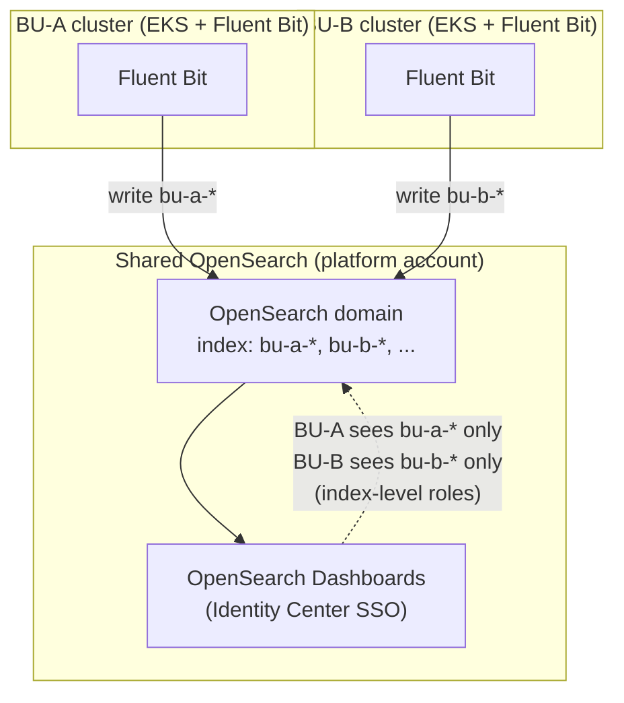
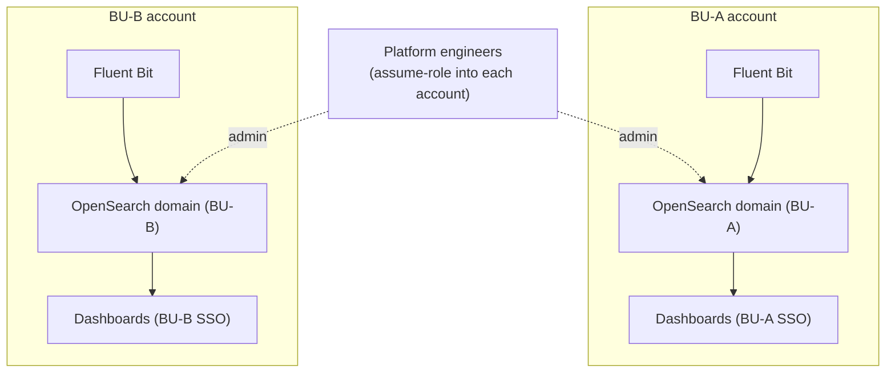
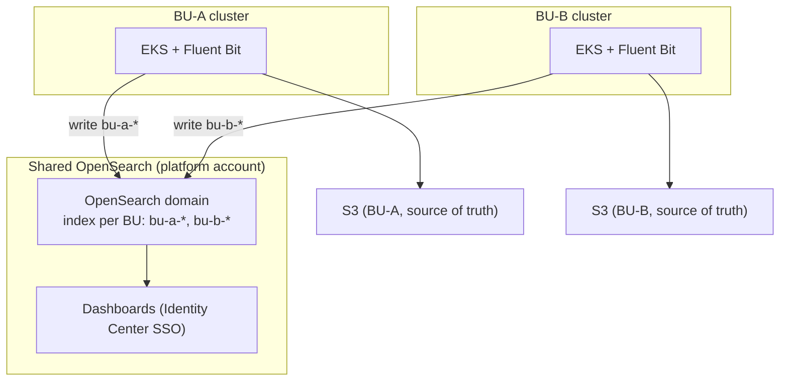

# ADR-017: OpenSearch Deployment Model

**Status:** Accepted (Oct) — **single shared OpenSearch cluster** with per-business-unit indexes and logical isolation. Conditional on security sign-off (see "Security review strategy"). Reverses an earlier per-business-unit decision, which is kept below as a considered alternative and a possible future option. Build in progress (#8420).
**Parent:** [ADR-017: Logging and Log Management Architecture](ADR-017-logging-and-log-management.md)
**Related ticket:** [cloud-platform#8420](https://github.com/ministryofjustice/cloud-platform/issues/8420) (child of #8415)
**Category:** Observability / Logging
**Owner:** Cloud Platform team. Produced during the AWS ProServe CP3 engagement; maintained by
the platform team thereafter.

---

## Purpose

ADR-017 picks OpenSearch for full-text log search. This page records how it is deployed: the
model chosen, why, the alternatives considered, the trade-offs (including CloudWatch and tracing),
and what is still open. It is a **living document** — updated as the build progresses.

The decisions it covers:

1. **Service model** — provisioned (managed) OpenSearch. Serverless was considered and dropped.
2. **Placement** — a single shared cluster, with each business unit's logs in its own index.
3. **Cost** — compared across models, and against today's ~$54k/month.
4. **Build-out** — public endpoint for now (private once VPN exists), audit logging on, per-index
   retention, logical isolation via fine-grained access control.

Out of scope: the Cortex XSIAM / SOC forwarding path (a separate concern on the S3 side), and
the tracing decision itself (ADR-005 — noted here only where it touches the logging choice).

---

## Decision

**A single shared OpenSearch cluster, with each business unit separated by in-cluster controls —
not one cluster per business unit.**

Each business unit's logs go into **its own index** (today they share a single index, so every
user can see every other team's logs). Business units are kept apart by **logical isolation** —
fine-grained access control with index-level permissions, document- and field-level security —
rather than by a physical account boundary. Full managed OpenSearch; Serverless is not used (D2).

### Why shared

- **Over-provisioning, not the model, is the biggest cost.** The current cluster has ~211 TB of
  hot disk provisioned but only ~22% used. That is a sizing problem fixed by right-sizing, and it
  is independent of how many clusters there are.
- **Every cluster carries a standing cost** for its own master nodes, regardless of use. Per-BU
  clusters multiply that across many small clusters; a shared cluster retires most of it.
- **Noisy neighbour is manageable inside a shared cluster** — per-index isolation, search
  backpressure, per-request resource limits, and dedicated node pools for heavy tenants. This was
  the main thing that had pointed to per-BU.
- **Per-BU retention does not need separate clusters** — per-index lifecycle (ISM) policies handle
  differing retention within one cluster.
- **Physical isolation is not a hard requirement.** Logical isolation is accepted, consistent with
  the approach already agreed for Grafana.
- **Shared now keeps the option open** to split per-BU later; the reverse migration would be very
  hard.

> **Conditional on security sign-off.** The shared model depends on the security function
> accepting logical isolation in place of a physical account boundary. That has not yet been
> confirmed — see "Security review strategy". If security mandates physical separation for a data
> classification, that subset reverts to per-BU (Option B, below).

---

## Alternatives considered

Three placement models were worked through in detail. They are kept here so the analysis is not
lost, and because **Option B (per-BU) remains the documented fallback** if security requires
physical separation.

| Option | What it is | Isolation | Ops effort | Main trade-off |
|---|---|---|---|---|
| **A — Shared cluster, per-BU index (CHOSEN)** | One cluster for everyone; each BU's logs in its own index, visible only to that BU. One filing cabinet, a locked drawer per team. | Logical (index-level roles) | Lowest — one cluster | Noisy neighbour — mitigated by in-cluster controls |
| **B — Cluster per BU, in BU accounts** | Each BU its own cluster in its own AWS account. Fully separate. | Physical (account boundary) | Highest — 8–9 clusters across accounts | Most to run; standing master-node cost per cluster |
| **C — Cluster per BU, one account** | Each BU its own cluster, all in one shared account. | Physical (cluster boundary) | High — 8–9 clusters | Middle ground |

**Why A (shared) was chosen over B and C.** A was originally ruled out on noisy-neighbour grounds
from lived experience. The reconsideration — once the cost breakdown landed — is that the
noisy-neighbour risk is **addressable with in-cluster controls** (per-index isolation,
backpressure, resource limits, dedicated node pools). With that risk handled, A's advantages
dominate: lowest standing cost (no per-cluster master nodes multiplied across BUs), and the saving
is really in right-sizing, which A does not block. B and C both remove noisy neighbour but at the
cost of 8–9 clusters, each with its own master-node standing charge.

**Why Option B is kept as a future option.** B gives the strongest isolation — a physical account
boundary — and fits the "BU resources in BU accounts" principle. If security mandates physical
separation (for all log data, or a specific classification), B is the fallback, in whole or for
that subset. Moving shared → per-BU later is feasible; the reverse is not, which is why starting
shared is the lower-risk order.

### Diagrams

**Option A — one shared cluster, per-BU indexes (chosen)**

Every BU's Fluent Bit writes into one shared cluster, each to its own index. Index-level roles
mean a BU sees only its own logs. One cluster to run; isolation is logical.

| Pros | Cons |
|---|---|
| Lowest standing cost — one cluster, one set of master nodes | Noisy neighbour (mitigated by in-cluster controls) |
| Least to manage and patch | Isolation is logical, not physical |
| Matches how we do Grafana today | One cluster down = everyone down |
| Single place to search | Needs careful FGAC + per-index design |

**Option B — one cluster per BU, in each BU's account (fallback)**

Each BU its own cluster in its own account. Strongest isolation, no noisy neighbour — but 8–9
clusters to run, each carrying its own master-node standing cost, and the platform team must
assume-role into each account.

**Option C — one cluster per BU, all in one account**

Same as B but all clusters in one account: no cross-account hop for the platform team, but weaker
isolation (cluster boundary only) and it doesn't fit "BU resources in BU accounts". Same cluster
count and standing cost as B.

### Cost analysis behind the choice

A per-cluster cost breakdown of the whole OpenSearch estate (49 clusters), snapshot taken
**5 October 2026**, measured the platform-vs-user split. Point-in-time view of the clusters as
configured on that date, not a specific billing month.

| | $/month | Share |
|---|---|---|
| **Platform logging clusters** (what this work replaces) | ~$71,800 | **70%** |
| **User-deployed clusters** (teams' own search clusters) | ~$31,000 | 30% |
| **Whole OpenSearch estate** | ~$102,800 | 100% |

The platform logging clusters are ~70% of all OpenSearch spend — four clusters: `cp-live-app-logs`
(~$59,400), the older Elasticsearch logging cluster (~$8,300), `cp-live-2-app-logs` (~$2,200),
`cp-live-modsec-audit` (~$2,000).

**Over-provisioning is the key signal.** `cp-live-app-logs` has **~211 TB of hot (gp3) disk
provisioned but only ~47 TB used — about 22%** (18 data nodes × a fixed 12 TB volume). The root
cause is known: during an incident the tiering stopped moving logs from hot to warm, the hot disk
was scaled up fast to stop it filling (3 TB → 4 → 8 → 12 TB per node in a month), the tiering was
fixed, but the disk was **never scaled back down**. It is leftover emergency headroom, not a size
anyone would choose. The ISM tiering is now working (hot→warm after ~1 day). So the saving is in
**right-sizing it back**, which is independent of the deployment model — reinforcing that the
model is not where the money is. (Source: `app-opensearch.tf` in `cloud-platform-infrastructure`;
detail in the research note `decision/why-current-cluster-is-oversized.md`.)

> **Treat these as relative, not exact.** Built from AWS Pricing API **on-demand** rates on each
> cluster's current config as if it ran all month — higher than the real bill (no reserved-
> instance/savings-plan discounts, no mid-month changes). For comparison, not billing.
> Source data: `project-doc/research/8420-opensearch-model/cost-data/opensearch-cost-breakdown.csv`.

**On the standing cost that drives the choice:** each per-BU cluster needs its own master nodes
(~£1.5k/month equivalent per cluster), a cost that exists regardless of utilisation. Across many
small BU clusters this adds up — and it is the main cost a shared cluster avoids.

---

## Security review strategy

The shared-cluster decision rests on the security function accepting **logical** isolation in
place of a physical account boundary. That is the gating risk, so it is tested with security
early, not assumed.

**The ask — one clear question:**

> We propose a single shared OpenSearch cluster for platform logs, with business units separated
> by in-cluster controls rather than separate AWS accounts. Is logical isolation acceptable for
> this log data, or is physical separation mandated for any data classification?

A yes/no on physical separation is the decision. If physical separation is required for a subset
(e.g. a particular classification), that subset uses Option B (per-BU) and the rest is shared.

**How the review is run:**
- **Lead with the Grafana precedent** — logical isolation is already accepted there, so this
  extends an accepted pattern rather than proposing a new one.
- **Bring the controls as the mitigation** — the table in "Security hardening" below.
- **Be explicit about the limit** — this is logical, not physical, isolation (shared nodes and
  storage). Stating it up front gets the real answer faster.
- **Demonstrate on the dev cluster** — a business-unit role that can see only its own index, a
  field-masking example, and a denied cross-index query in the audit log.
- **Record the outcome here** — whatever security decides (logical accepted, or physical required
  for X) is captured in this ADR with owner and date, as the justification for the model.

**Open questions to resolve before the review:** who owns security sign-off for platform logging;
whether any data classification triggers a physical-separation rule; any BU with a
contractual/regulatory override; and reconciling the 13-month security (SIEM) retention from the
parent logging ADR with the operational retention in the shared-index design.

## Security hardening

The chosen model shares a baseline with the per-BU fallback; what differs is **where the isolation
between business units comes from**. Grounded in AWS documentation.

### Baseline — applies either way

- Private, VPC-only domain (no internet access).
- Security groups allowing traffic only from known sources.
- HTTPS enforced — move to **TLS 1.3** (`Policy-Min-TLS-1-2-PFS-2023-10`); our config is currently
  TLS 1.2 only (`Policy-Min-TLS-1-2-2019-07`). Node-to-node encryption; encryption at rest with a
  customer-managed key (CMK).
- Fine-grained access control (FGAC) on, with sign-in through Identity Center single sign-on.
- Audit logging on, shipped to CloudWatch.

### Shared cluster (chosen) — isolation inside the cluster

With no account boundary, isolation is rebuilt inside the cluster with fine-grained access
control. AWS supports this as a multi-tenant pattern.

| Control | What it gives each business unit |
|---|---|
| Index-level permissions | A unit sees only its own indices — the main isolation. |
| Document-level security | Restrict which documents a role can see. |
| Field-level security / masking | Hide or anonymise sensitive fields (e.g. personal data). |
| Backend roles | Map a unit's Identity Center groups to OpenSearch roles. |
| Tenants | Separate Dashboards spaces per unit. |

Two more controls make a shared cluster workable:
- **Noisy neighbour** — search backpressure, per-request limits, shard allocation, and dedicated
  node pools for heavy tenants stop one unit slowing the others.
- **Per-unit retention** — lifecycle (ISM) policies run per index, so each unit keeps its own
  retention in one cluster.

**The limit:** these controls are strong, but they are **logical** separation, not physical —
everything shares the same nodes and storage. If there is a documented mandate for physical
separation of a unit's log data, a shared cluster cannot meet it, and Option B (per-BU) is used.

### Per-BU fallback (Option B) — isolation by account boundary

Isolation comes from the AWS account boundary: each unit's cluster is in its own account, so one
unit simply cannot reach another's. Strongest separation, nothing extra needed beyond the
baseline — but each cluster carries its own master-node standing cost.

---

## Decisions made

| # | Decision | Basis | Status |
|---|---|---|---|
| DS | **Single shared cluster with per-BU indexes and logical isolation.** Driven by cost (over-provisioning is the real issue; per-cluster master-node standing cost); noisy neighbour handled in-cluster; physical isolation not a hard requirement; mirrors Grafana. | Fluent Bit + OpenSearch review (Oct) | Accepted — pending security sign-off |
| DB | **Option B (one cluster per BU, own account) kept as the fallback** if security mandates physical separation. Was the accepted decision 30 Sept–early Oct; superseded by DS on cost grounds once noisy neighbour was judged addressable in-cluster. | Status call 30 Sept | Fallback / future option |
| D12 | **Audit logging is on from the first build.** Verbosity tuning to control ingest cost is a separate follow-on ticket (#8585), not a blocker. | Architecture review | Agreed |
| D13 | **Log retention is configurable per index (per BU), not a single global value.** The mechanism is per-index ISM; the exact durations firm up once regulatory guidance lands. | Architecture review | Agreed |
| D15 | **Platform-managed cluster is read-only for BU engineers; self-deployed clusters keep admin.** SSO via IAM Identity Center, like Grafana. | Architecture review | Agreed |
| D17 | **Public endpoint for now** (reverses D11, temporarily). There is no VPN for the team to reach a private domain, so a private Dashboard would be unreachable; the current live cluster and Grafana are both public. Still locked down by fine-grained access control and HTTPS. A follow-up ticket moves it to private once VPN access exists. Fluent Bit's write path stays private either way. | Status call 8 Oct | Agreed (interim) |
| D11 | ~~**Private, not internet-facing** — reached over VPN, transit gateway and VPC endpoints.~~ **Superseded by D17 for now** (no VPN to reach it). Remains the target end state. | Architecture review | Superseded (interim) |
| D1 | **Provisioned (managed) domain.** | Team decision | Agreed |
| D2 | **Serverless is not used.** Provisioned in dev only ~2-3×/year, so idle-cost saving is minimal, and Serverless wouldn't match managed prod. | Status call 30 Sept | Agreed |
| D5 | **Engine version pinned to `OpenSearch_3.7`** (latest in eu-west-2). | Verified via `aws opensearch list-versions` | Agreed |
| D7 | **Split live and non-live** instances, like Grafana. | Design review | Agreed |
| D8 | **Deployment code at the repo root**, not under a cluster, so it deploys first. The `cluster-observability` folder is being deleted. | Design review | Agreed |
| D9 | **`ministryofjustice/cloud-platform` is the source of truth.** Internal AWS CodeCommit is out of date. | Design review | Agreed |
| D10 | **S3 is the durable source of truth for logs.** Fluent Bit writes to CloudWatch, S3 and OpenSearch, each feature-flagged. Possible S3 → OpenSearch pipeline to filter and avoid log loss. | Status call 30 Sept | Agreed |
| D6 | **Involve the platform team early**, so OpenSearch follows the Grafana/AMG patterns (ADR-005). | Team decision | To action |
| D14 | ~~No cross-BU aggregation (platform team logs into each per-BU cluster).~~ **Reframed by DS** — with one shared cluster there is a single place to search; the question falls away. | Architecture review | Superseded by DS |
| D16 | **Direction: the 34 user dashboards should move to Grafana.** Recorded as context; **out of scope for #8420**, owned elsewhere. | Architecture review | Noted — not this work's remit |
| D3 | ~~One index per BU in a shared cluster.~~ Originally superseded by Option B; **now the chosen model again under DS.** | Was Option A model | Reinstated under DS |
| D4 | ~~One shared Observability account.~~ **Superseded** — OpenSearch goes in the development account for the PoC. | Design review | Superseded |

---

## CloudWatch Logs vs OpenSearch — why OpenSearch

We already send all logs to CloudWatch Logs, so it is fair to ask whether OpenSearch is needed at
all. Conclusion: OpenSearch stays.

| | CloudWatch Logs | OpenSearch |
|---|---|---|
| Full-text search | Logs Insights, but **notably slower** and scans per query | Fast full-text search over an index — the main reason to keep it |
| Search UX | Functional, not built for exploratory investigation | Dashboards — what engineers expect |
| Alerting | Metric filters + alarms, alarm-on-query | Log-based alerting for non-metric events |
| Cost model | Ingestion + per-query scan; long retention gets expensive | Standing cluster, built for search at depth |
| Already have it | Yes | New cluster to run |

**Cost comparison (verified eu-west-2 rates):**

| | CloudWatch Logs | OpenSearch |
|---|---|---|
| Ingestion | **$0.5985/GB** | No per-GB ingest charge |
| Storage | $0.0315/GB-month | EBS gp3 $0.1415/GB-mo (hot); UltraWarm/S3 $0.024/GB-mo (warm) |
| Search | **$0.0059/GB scanned, every query** | No per-query charge |

**Worked example** — placeholder **1 TB/day** (~30 TB/month), 30-day retention (real volume is
**TO MEASURE**):

- *CloudWatch:* ingest ~$17,955 + storage ~$945 + search ~$531 ≈ **~$19,430/month**.
- *OpenSearch:* compute (shared cluster, right-sized) + storage (~30 TB mostly UltraWarm at
  $0.024/GB-mo ≈ $720) + free search ≈ **a few $k/month**.

**Takeaway:** CloudWatch charges to ingest and again to scan on every query; OpenSearch is a flat
cluster cost with free search. So the design keeps **CloudWatch short-retention (operational,
~30 days)** and uses **OpenSearch for fast full-text search at depth**.

## Tracing — a consideration for the logging choice

CP3 may add distributed tracing (CP2 has none). Tracing isn't decided here (ADR-005), but *where*
traces go affects the logging tool choice. Two homes, both fed by OpenTelemetry (ADOT):

- **X-Ray (+ ADOT)** — fully managed, viewed in the CloudWatch console; standard EKS path. But
  metrics (Grafana) + logs (OpenSearch) + traces (X-Ray) = three UIs.
- **OpenSearch Trace Analytics (+ Data Prepper)** — keeps logs and traces in the **same
  Dashboards**; costs extra load/storage on the cluster and running Data Prepper.

**Recommendation:** don't decide tracing here, but note that choosing OpenSearch for logs keeps
the door open to a single logs-plus-traces UI. Weigh against X-Ray's managed simplicity when
tracing is designed.

## S3 as the source of truth, and the ingestion pipeline

**S3 is the durable, central source of truth for logs** (D10) — non-negotiable. Every log goes to
S3 for long-term retention, audit, and independent SOC access. OpenSearch and CloudWatch are
*consumers*; S3 is the record.

**The problem it fixes.** Today Fluent Bit writes to OpenSearch directly; when OpenSearch is down,
Fluent Bit buffers only so much before **dropping logs**. Writing to **S3 first** with an
**event-driven pipeline into OpenSearch** gives no log loss (S3 holds everything) and filtering
(choose what gets indexed into the costed search tier). The three destinations are independently
feature-flagged (D10). *(Pipeline is a direction, not yet built; Fluent Bit multi-output is #8419.)*

---

## Target deployment shape

How the shared model is built, following patterns already in the repo (mirrors how `amg.tf` is
deployed). The dev proof-of-concept comes first, in the development account.

### Where the code lives
`opensearch.tf` at the **repo root** (next to `amg.tf`), not under `cluster/` (D8). Deploys at the
account level.

### The cluster
- One shared domain, engine **`OpenSearch_3.7`** pinned (D5), managed/provisioned (D2).
- **FGAC + node-to-node encryption + encryption at rest (CMK)** — the base of the logical-isolation
  model.
- Live/non-live split (D7). Sized against measured volume — **right-sizing is the main cost lever**
  (the current cluster's 18 × 12 TB fixed sizing is the anti-pattern to avoid).
- HA for production: dedicated master nodes + zone awareness (the dev PoC runs smaller — see the
  Checkov note).

### Per-BU indexes and isolation (the core of the shared model)
- Each BU's logs go into **its own index** (logs already arrive per-namespace, so splitting by
  source is straightforward).
- **Index-level permissions** so a BU sees only its own indices; **document- and field-level
  security** for finer control and masking.
- **ISM lifecycle per index** for per-BU retention and hot→warm→cold tiering.
- **Noisy-neighbour controls**: search backpressure, per-request limits, dedicated node pools for
  heavy tenants.
- Index-level roles, ISM, and FGAC role mappings are **in-cluster settings** — they need the
  OpenSearch Terraform provider (not just the domain resource), which is a build dependency.

### Network
- **Public endpoint for now (D17)**, locked down by fine-grained access control and HTTPS — the
  team has no VPN to reach a private domain yet, and the live cluster and Grafana are public too.
- **Target: private (in-VPC) (D11)** — reached over VPN / transit gateway / VPC endpoints, once
  that access exists. Tracked as a follow-up ticket. Fluent Bit's write path is private regardless.

### Access
- **IAM Identity Center SSO** (ADR-004 / AMG pattern). Platform engineers admin; BU engineers
  read-only on the platform cluster (D15). BU Identity Center groups map to OpenSearch roles via
  backend roles.

### Audit logging
- **On (D12)**, to a CloudWatch log group under `/aws/vendedlogs/` with one broad resource policy
  (CloudWatch allows only 10 resource policies per Region). Retention per index (D13). Verbosity
  tuning is #8585.

### Ingestion (D10)
- Fluent Bit (cluster-scoped, #8419) → S3 + CloudWatch + OpenSearch, each feature-flagged.
- **Fluent Bit → OpenSearch needs write access**: a FGAC role mapping for the Fluent Bit role
  (EKS Pod Identity, named `<cluster>-fluent-bit`), scoped to write its BU's index. This is the
  hand-off with #8419 and needs the OpenSearch provider.

### Open questions for the build

Nothing here blocks the dev proof-of-concept — a single dev cluster can be built now.

**Still blocking the full rollout**
- **Security sign-off on logical isolation** (see "Security review strategy") — the gating item.
- **Retention durations and tiers** — mechanism is per-index ISM; values blocked on regulatory
  guidance.
- **Fluent Bit write access** — FGAC role mapping for the Fluent Bit Pod Identity role
  (`<cluster>-fluent-bit`); needs the OpenSearch provider and the role from #8419 (not yet on main).
- **Per-index design + ISM + resource isolation** — in-cluster config, needs the OpenSearch
  provider wired up.

**Before go-live**
- **Full-scale cost, storage-first** — platform-vs-user split measured (~70% platform); target
  saving pending the retention/tiering numbers.
- **HA sizing** — dedicated master nodes + zone awareness for production (dev PoC runs smaller).
- **CMK** — production should use a customer-managed key; the dev PoC uses the AWS-managed `aws/es`
  key (the shared `general-<bu>` key is in the shared-services account, not dev).
- **TLS 1.3** — switch `tls_security_policy` to `Policy-Min-TLS-1-2-PFS-2023-10`.

**Security scanning note.** The deployment code passes Checkov with documented skips tied to the
above (CMK and dedicated-master HA deferred to production; CloudWatch log-group KMS per the
existing platform convention — the audit group is the short-retention operational tier). None is
an unreviewed failure.

---

## Verified facts (AWS docs / Pricing API, eu-west-2)

- **Provisioned instance rates (per hour):** `or1.medium.search` $0.123, `or1.large.search`
  $0.246, `or1.xlarge.search` $0.491, `r6g.large.search` $0.197, `r6g.xlarge.search` $0.393,
  `r6g.4xlarge.search` $1.572, `m6g.large.search` $0.147, `ultrawarm1.medium.search` $0.276.
  EBS gp3 $0.1415/GB-month; managed/UltraWarm S3 $0.024/GB-month.
- **CloudWatch Logs:** ingest $0.5985/GB; storage $0.0315/GB-month; Logs Insights scan
  $0.0059/GB.
- **Shard limits:** 3.7 allows 1,000 shards per 16 GB of heap, up to 4,000 per node.
- **Engine versions in eu-west-2:** `OpenSearch_3.7` (latest), 3.5, 3.3, 3.1, 2.19, 2.17, …
- **TLS policies:** `Policy-Min-TLS-1-2-2019-07` (1.2 only), `Policy-Min-TLS-1-2-PFS-2023-10`
  (adds TLS 1.3 + PFS), `Policy-Min-TLS-1-2-RFC9151-FIPS-2024-08` (FIPS).

Cost totals built from these rates are estimates until real log volume is measured.

---

## PoC plan

OpenSearch goes in the **development account** (D4), code at the **repo root** (D8). Throwaway
config to keep costs down, then torn down (domains are billable).

1. Provisioned domain — engine `OpenSearch_3.7`, small, FGAC on, **public endpoint for now**
   (private once VPN exists), audit logging on, TLS 1.3. Managed only (D2).
2. Create a per-BU index + an index-level role; confirm a BU role sees only its own index.
3. Load sample logs via SigV4 `_bulk` (Fluent Bit is #8419 and depends on this).
4. Confirm SSO sign-in and read-only access for a BU engineer; admin for platform engineers.
5. Record query speed, Dashboards behaviour, and cost; build the full-scale figure.

Updated as the PoC produces results.

---

## References

- [ADR-017: Logging and Log Management Architecture](ADR-017-logging-and-log-management.md)
- [ADR-005: Observability Stack](ADR-005-observability-amp-amg-adot.md)
- Research: `project-doc/research/8420-opensearch-model/` — `decision/` (model choice, cost,
  why-oversized), `access/` (dashboards access, security hardening + review strategy),
  `follow-on-work/` (#8592 plan, sub-ticket drafts), `cost-data/` (the cost CSV).
- [Fine-grained access control in Amazon OpenSearch Service](https://docs.aws.amazon.com/opensearch-service/latest/developerguide/fgac.html)
- [TLS 1.3 / PFS on Amazon OpenSearch Service](https://aws.amazon.com/blogs/big-data/enhance-security-and-performance-with-tls-1-3-and-perfect-forward-secrecy-on-amazon-opensearch-service)
- [Amazon OpenSearch Service pricing](https://aws.amazon.com/opensearch-service/pricing/)
