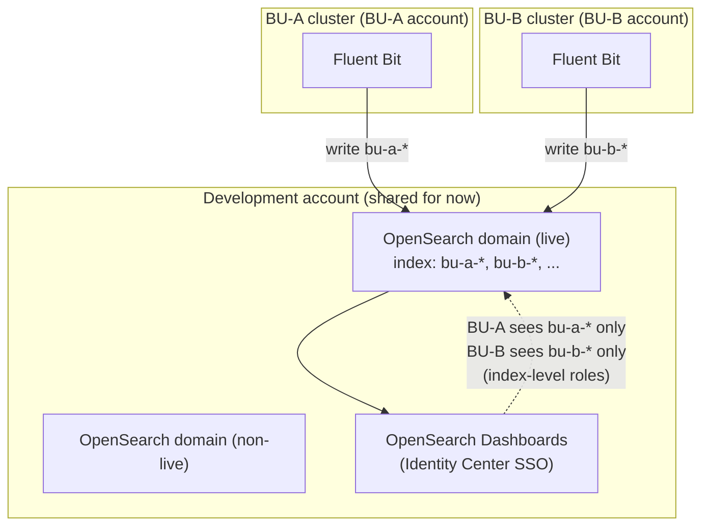
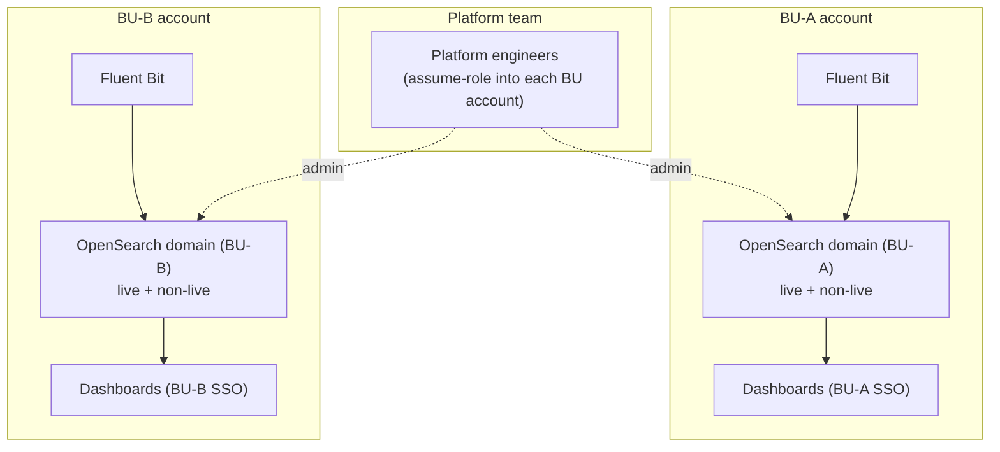
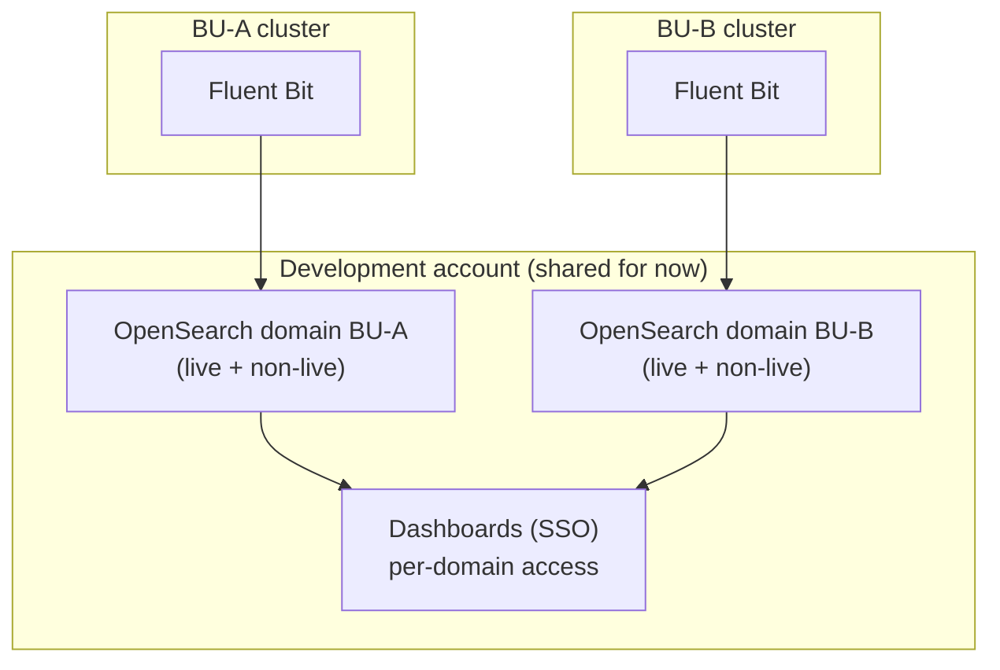

# ADR-017: OpenSearch Deployment Model

**Status:** Accepted — Option B chosen (30 Sept); build in progress (#8420)
**Parent:** [ADR-017: Logging and Log Management Architecture](ADR-017-logging-and-log-management.md)
**Related ticket:** [cloud-platform#8420](https://github.com/ministryofjustice/cloud-platform/issues/8420) (child of #8415)
**Category:** Observability / Logging

---

## Purpose

ADR-017 picks OpenSearch for full-text log search. This page records how it is deployed: the
model chosen, why, the trade-offs considered (including CloudWatch and tracing), and what is
still open. It is a **living document** — updated as the build progresses.

The decisions it covers:

1. **Service model** — provisioned (managed) OpenSearch. Serverless was considered and dropped.
2. **Placement** — one cluster per business unit, each in its own AWS account (Option B).
3. **Cost** — compared across models, and against today's ~$54k/month.

Out of scope: the Cortex XSIAM / SOC forwarding path (a separate concern on the S3 side), and
the tracing decision itself (ADR-005 — noted here only where it touches the logging choice).

---

## Decision (30 Sept)

**Option B chosen: one OpenSearch cluster per business unit, each in its own AWS account.**

- **Option A (shared cluster, per-BU index) — ruled out.** Lived experience with the current
  shared cluster shows logical isolation does not stop noisy-neighbour degrading other BUs.
- **Option B over Option C:** both give physical isolation; C needs a more complex permissions
  scheme to stop cross-BU access, while B gets isolation for free from the account boundary.
  Cost is the same either way. Security stakeholders prefer the account boundary.
- **Full managed OpenSearch for both live and non-live** — Serverless not used (see D-serverless
  below).

The options are described below for the record.

## The options

Three ways to place OpenSearch across the BUs. Diagrams for each are below.

| Option | What it is | Isolation | Ops effort | Main trade-off |
|---|---|---|---|---|
| **A — Shared cluster, per-BU index** | One OpenSearch cluster for everyone. Each BU's logs go into its own index, and each BU can only see its own. Like one filing cabinet with a locked drawer per team. | Logical (index-level roles) | Lowest — one cluster | Noisy neighbour: one BU can slow others |
| **B — Cluster per BU, in BU accounts** | Each BU gets its own OpenSearch cluster, living in that BU's own AWS account. Teams are fully separate — own cluster, own account. | Physical (account boundary) | Highest — 8–9 clusters across accounts | Most to run and manage |
| **C — Cluster per BU, one account** | Each BU gets its own cluster, but they all sit in one shared account. Separate clusters, one place to manage them. | Physical (cluster boundary) | High — 8–9 clusters | Middle ground |

**In short:**

- **A** is cheapest to run, but shares compute between BUs — the noisy-neighbour risk. The
  current shared cluster has shown this risk is real, not theoretical, so **A was ruled out**.
- **B** and **C** both remove noisy neighbour by giving each BU its own cluster, at roughly the
  same cost (8–9 clusters). They differ only in account layout.
- **Cost is not the deciding factor** — the split barely changes total cost. The real choice was
  isolation and operability, which is why **B was chosen** (account-boundary isolation, cleaner
  security story).

**Outcome (30 Sept):** Option B chosen. Option A ruled out on noisy-neighbour grounds (from
lived experience), Option C rejected in favour of B's account-boundary isolation.

### Diagrams

Draft sketches for review — the final AWS-icon diagram is added once the model is chosen.
All apply the live/non-live split (D7).

**Option A — one shared cluster, per-BU indexes**

Every BU's Fluent Bit writes into one shared OpenSearch cluster, each to its own index
(`bu-a-*`, `bu-b-*`). In Dashboards, index-level roles mean a BU can only see its own logs.
One cluster to run, but the BUs share the same compute — so a heavy BU can slow the rest.

| Pros | Cons |
|---|---|
| Cheapest to run — one cluster | Noisy neighbour: one BU can slow others |
| Least to manage and patch | Isolation is logical, not physical |
| Matches how we do Grafana today | Cross-account access to reach the shared cluster |
| Simple, single place to search | One cluster down = everyone down |

**Rough cost:** lowest — one cluster sized for the whole estate. Illustrative ~$360–540/month
compute (live), before storage. Storage is the same for every option.

**Option B — one cluster per BU, in each BU's account**

Each BU has its own OpenSearch cluster inside its own AWS account. Fluent Bit writes locally,
and access is bounded by the account itself. Full separation, so no noisy neighbour — but the
platform team must reach into each account (assume-role) to manage 8–9 clusters.

| Pros | Cons |
|---|---|
| Strongest isolation — account boundary | Most to run: 8–9 clusters across accounts |
| No noisy neighbour | Platform team assume-roles into each account |
| Fits "BU resources in BU accounts" | Highest ops and patching effort |
| One BU's outage stays with that BU | Fluent Bit writes are same-account (simple), but harder to see everything in one place |

**Rough cost:** ~$449/BU/month (live + non-live), so **~$4,000/month for 9 BUs**, before
storage. Storage is the same as the other options. (Illustrative on verified eu-west-2 rates;
real figure needs measured log volume.)

**Option C — one cluster per BU, all in one account**

Each BU still gets its own cluster, so there's no noisy neighbour — but all the clusters sit
in one shared account. Separate clusters keep the BUs apart; the single account keeps them in
one place to manage. Still 8–9 clusters to run, but no cross-account hop.

| Pros | Cons |
|---|---|
| No noisy neighbour — separate clusters | Still 8–9 clusters to run and patch |
| One account to manage them all | Doesn't fit "BU resources in BU accounts" |
| No cross-account hop for the platform team | Cross-account writes from each BU's Fluent Bit |
| Simpler access than per-account (Option B) | More to run than the shared cluster (Option A) |

**Rough cost:** the **same as Option B** — ~$449/BU/month, ~$4,000/month for 9 BUs, before
storage. Same cluster sizes and counts; only the account layout differs, which is not a
cost factor.

### B vs C — what's actually different

Both give each BU its own cluster, so both remove noisy neighbour and both mean 8–9 clusters
to run. The only difference is **which account the clusters live in**.

| | Option B (BU accounts) | Option C (one account) |
|---|---|---|
| Where clusters live | Each in its BU's own account | All in one shared account |
| Isolation | Account **and** cluster boundary — strongest | Cluster boundary only |
| Fits "BU resources in BU accounts" | Yes | No |
| Platform team access | Assume-role into each BU account | One account, no hop |
| Fluent Bit writes | Same-account (simple) | Cross-account into the shared account |

In short: **B** is stronger on isolation and fits the BU-owns-its-resources principle, but the
platform team has to hop across accounts to manage it. **C** is easier for the platform team
(one account) but weaker on isolation and doesn't fit that principle.

---

## Decisions made

| # | Decision | Basis | Status |
|---|---|---|---|
| DB | **Option B: one OpenSearch cluster per BU, each in its own AWS account.** Account boundary gives natural isolation and the cleaner security story; A ruled out (noisy neighbour), C rejected (needs complex cross-BU permissions for no cost saving). | Status call 30 Sept | Agreed |
| D1 | **Live runs on a provisioned (managed) domain.** | Team decision | Agreed |
| D2 | **Serverless is not used — for live or non-live.** OpenSearch is provisioned in dev only ~2-3×/year, so the idle-cost saving is minimal, and a Serverless non-live wouldn't match managed prod (weakens upgrade testing). Full managed OpenSearch everywhere. | Status call 30 Sept | Agreed |
| D5 | **Engine version pinned to `OpenSearch_3.7`** (latest in eu-west-2). Always pin versions — don't rely on defaults. | Verified via `aws opensearch list-versions` | Agreed |
| D7 | **Split live and non-live** into separate instances per BU, like Grafana. The split costs about the same as one big instance — storage and data transfer are the same either way; live can just be bigger. | Call with William | Agreed |
| D8 | **Deployment code goes at the repo root**, not under a cluster, so it deploys first and clusters point at it. The `cluster-observability` folder is being deleted — do not use it. Fluent Bit config stays with the clusters. | Call with William | Agreed |
| D9 | **`ministryofjustice/cloud-platform` is the source of truth.** The internal AWS CodeCommit repo is out of date — don't use it. ADR changes go via branch + PR here. | Call with William | Agreed |
| D10 | **S3 is the durable source of truth for logs.** Fluent Bit writes to CloudWatch, S3 and OpenSearch, each independently toggleable via a feature flag. A possible S3 → OpenSearch ingestion pipeline could filter what gets indexed and avoid log loss when OpenSearch is down. | Status call 30 Sept | Agreed |
| D6 | **Involve the platform team early**, so OpenSearch follows the same patterns as the Grafana/AMG setup (ADR-005). | Team decision | To action |
| D3 | ~~One index per BU in a shared cluster.~~ **Superseded** by the Option B decision (DB) — each BU now has its own cluster, so there is no shared-cluster per-BU index. | Was Option A model | Superseded |
| D4 | ~~One shared Observability account for live and non-live.~~ **Superseded.** No such account exists yet, so OpenSearch goes in the **development account** for now. | Call with William | Superseded |

---

## Resolved at the 30 Sept status call

| # | Question | Outcome |
|---|---|---|
| Q1 | Which placement — A, B or C? | **Option B** (cluster per BU, own account). A ruled out on noisy neighbour, C rejected in favour of B's account isolation. |
| Q1a | Is per-BU really more expensive? | No — cost is the same between B and C, and only modestly higher than a shared cluster. Not the deciding factor. |
| Serverless | Use Serverless for non-live? | **No.** Dev provisions OpenSearch only ~2-3×/year, so idle-cost saving is minimal, and Serverless non-live wouldn't match managed prod. Full managed everywhere. |

## Still open

| # | Question | Why it matters | Next step |
|---|---|---|---|
| O1 | **Cross-cluster querying** — can we query across the per-BU clusters from one place, like a central Grafana over many data sources? | Option B gives each BU its own cluster; engineers may need a single search view across BUs. | **Answered: yes — OpenSearch cross-cluster search (CCS).** See the section below. |
| O2 | **CloudWatch Logs vs OpenSearch** — is OpenSearch needed, given CloudWatch already has all logs, search, alerting and (via X-Ray) tracing? | Avoid assuming OpenSearch by default. | Brief trade-off analysis (Mohammad) — see below. OpenSearch expected to remain (full-text search speed + UX, log-based alerting). |
| O3 | **Query speed on engine 3.7** and **Dashboards** behaviour. | Engineer experience. | Confirm on the build. |
| O4 | **Full-scale cost** vs today's ~$54k/month. | Cost deliverable (NFR-106). Tom is costing the current live cluster (18× r6g.4xlarge + 40× ultrawarm1.medium + 5× m6g.large master). | Build once real log volume is measured. |

---

## CloudWatch Logs vs OpenSearch — why OpenSearch

We already send all logs to CloudWatch Logs, so it is fair to ask whether OpenSearch is needed
at all. This is the trade-off; the conclusion is that OpenSearch stays.

| | CloudWatch Logs | OpenSearch |
|---|---|---|
| Full-text search | Logs Insights (query language), but **notably slower** and scans per query | Fast full-text search over an index — the main reason to keep it |
| Search UX | Functional, not built for exploratory log investigation | Dashboards — the experience engineers know and expect |
| Alerting | Metric filters + alarms, and alarm-on-query (no Lambda needed) | Log-based alerting for events not available as metrics |
| Cost model | Ingestion + per-query scan; long-term retention gets expensive | Standing cluster cost, but purpose-built for search at retention depth |
| Tracing | Via AWS X-Ray (separate view in CloudWatch) | Via Trace Analytics (ADOT) — could keep logs + traces in one UI |
| Already have it | Yes — all logs land here | New per-BU clusters to stand up |

**Why keep OpenSearch:**
- **Full-text search speed and UX** — the primary value. CloudWatch search is noticeably slower,
  and the Dashboards experience is what engineers rely on for investigation.
- **Log-based alerting** for conditions that aren't metrics.
- Retaining searchable logs at depth (14-day hot / 90-day warm) is what OpenSearch is built for;
  keeping that in CloudWatch is slow and costly.

**Why it's worth revisiting anyway:**
- CloudWatch already receives everything, does search + alerting, and covers tracing via X-Ray.
  If S3 → OpenSearch ingestion cuts latency to seconds, CloudWatch could become the redundant
  destination (D10 makes all three toggleable).
- **Tracing note:** CP3 may add tracing (not in CP2). If traces go to CloudWatch/X-Ray while
  logs stay in OpenSearch and metrics in Grafana, that's three UIs. OpenSearch Trace Analytics
  (ADOT-based) could keep logs and traces together — worth weighing when tracing is designed.
  *(Out of scope here; belongs with the observability/tracing decision.)*

**Cost comparison (verified eu-west-2 rates):**

| | CloudWatch Logs | OpenSearch |
|---|---|---|
| Model | Pay per GB ingested + storage + per-query scan | Standing cluster (instance-hours) + storage |
| Ingestion | **$0.5985/GB** ingested | No per-GB ingest charge (you run the cluster) |
| Storage | $0.0315/GB-month | EBS gp3 $0.1415/GB-mo (hot); UltraWarm/S3 $0.024/GB-mo (warm) |
| Search | **$0.0059/GB scanned, every query** | No per-query charge — search is what the cluster is for |

**What this means for the choice:**
- CloudWatch cost is driven by **ingestion ($0.60/GB)** and **per-query scanning**. At the
  platform's log volume, sending everything to CloudWatch and keeping it queryable long-term is
  expensive, and repeated searches add up (you pay to scan each time).
- OpenSearch cost is a **fixed standing cluster** (Option B ≈ ~$4,000/month for 9 BUs before
  storage) — but search itself is free once it's running, and it's built to search at 14-day
  hot / 90-day warm depth.
- So the models suit different jobs: **CloudWatch for short-retention operational logs**
  (ADR-017 keeps CloudWatch to ~30 days for exactly this cost reason), **OpenSearch for
  fast full-text search at depth.** Trying to do deep search in CloudWatch is both slow and
  costly per query; that is a core reason OpenSearch stays.

**Worked examples** — assumed volume, to show how the two cost curves behave. Real volume is
**TO MEASURE**; these use a placeholder of **1 TB/day** of logs across the estate (~30 TB/month)
and 30-day retention.

*Example 1 — CloudWatch Logs, 1 TB/day, 30-day retention:*

| Item | Calc | Monthly |
|---|---|---|
| Ingestion | 30,000 GB × $0.5985 | ~$17,955 |
| Storage (30 TB held) | 30,000 GB × $0.0315 | ~$945 |
| Search (say 5 filtered scans/day ≈ 3 TB scanned/day) | 90,000 GB × $0.0059 | ~$531 |
| **Total** | | **~$19,430/month** |

*Example 2 — OpenSearch (Option B), same 1 TB/day:*

| Item | Calc | Monthly |
|---|---|---|
| Compute (9 BUs, Option B) | fixed | ~$4,000 |
| Storage (30 TB, mostly UltraWarm/S3 at $0.024/GB-mo) | ~30,000 GB × $0.024 | ~$720 |
| Search | free once running | $0 |
| **Total** | | **~$4,720/month** |

*Takeaway:* on this placeholder volume, OpenSearch (**~$4,700/month**) is far cheaper than
CloudWatch (**~$19,400/month**) as a deep, searchable store — because CloudWatch charges
~$0.60/GB to ingest and again to scan on every query, while OpenSearch is a flat cluster cost
with free search. This is why the design keeps CloudWatch short-retention (operational) and uses
OpenSearch for search at depth. *(All figures illustrative — the 1 TB/day is a placeholder until
real volume is measured; totals will scale with it.)*

**Conclusion:** OpenSearch remains the log-search tool, for search speed, UX and log-based
alerting. CloudWatch stays as an operational/alerting destination (short retention to control
its per-GB cost) and may be dropped later if the S3 → OpenSearch path removes the need for it.

## Tracing — a consideration for the logging choice

CP3 may add distributed tracing (CP2 has none). Tracing isn't decided by this ADR — it belongs
to the observability strategy (ADR-005) — but *where* traces go affects the logging tool choice,
so it's worth noting here. There are two homes for traces, both fed by the same OpenTelemetry
(ADOT) instrumentation in the cluster.

| | X-Ray (+ ADOT) | OpenSearch Trace Analytics (+ ADOT / Data Prepper) |
|---|---|---|
| Where traces live | AWS X-Ray | OpenSearch indexes |
| Where you view them | CloudWatch console | OpenSearch Dashboards |
| Managed? | Fully managed | You run it on the OpenSearch cluster(s) + Data Prepper |
| Logs + traces in one UI | No — traces in CloudWatch, logs in OpenSearch | **Yes** — both in OpenSearch Dashboards |
| Extra cost | X-Ray per-trace pricing | More load/storage on the OpenSearch cluster |
| Confirmed | Standard EKS pattern | Verified: OpenSearch does support tracing via Trace Analytics |

**The trade-off:**
- **Fragmentation risk.** With X-Ray, engineers would have metrics in Grafana, logs in
  OpenSearch, and traces in CloudWatch/X-Ray — three separate UIs. That's the concern the team
  raised.
- **One-UI option.** Because we're already running OpenSearch for logs, **OpenSearch Trace
  Analytics could keep logs and traces in the same Dashboards** — fewer places to look. The cost
  is extra load and storage on the per-BU clusters (Option B), and running Data Prepper.
- **Managed simplicity.** X-Ray is fully managed and the standard EKS tracing path; it just
  lives in a different console.

**Recommendation:** don't decide tracing here, but note that **choosing OpenSearch for logs
keeps the door open to a single logs-plus-traces UI** via Trace Analytics. Weigh that against
X-Ray's managed simplicity when tracing is actually designed. Either way, tracing needs apps to
be instrumented with OpenTelemetry — a separate piece of work.

## S3 as the source of truth, and the ingestion pipeline

**S3 is the durable, central source of truth for logs** (D10) — non-negotiable. Every log goes
to S3 for long-term retention, audit, and so security teams (including SOC) can read raw logs
independently. OpenSearch and CloudWatch are *consumers* of logs; S3 is the record.

**The problem this fixes.** Today, Fluent Bit writes to OpenSearch directly. When OpenSearch is
unavailable, Fluent Bit can only buffer so much locally before it starts **dropping logs** —
so an OpenSearch outage means lost logs. That is a real gap in the current setup.

**The proposed shape.** Fluent Bit writes to **S3 first** (durable), and an **event-driven
pipeline ingests from S3 into OpenSearch**. This gives two wins:

- **No log loss** — S3 holds everything; if OpenSearch is down, nothing is dropped, it just
  catches up when OpenSearch is back.
- **Filtering** — the pipeline can choose *what* gets indexed into OpenSearch, so teams don't
  push excessive or low-value data into the (costed) search tier.

The S3 bucket was originally intended for SIEM/SOC forwarding and can serve both purposes. This
also means **CloudWatch could become redundant**: if S3 → OpenSearch latency gets low enough,
the operational need CloudWatch covers may be met by OpenSearch directly. All three destinations
(CloudWatch, S3, OpenSearch) are **independently toggleable via feature flag** (D10), so
destinations can be dropped without affecting the others.

*(The S3 → OpenSearch pipeline is a direction, not yet built. Fluent Bit multi-output work is
tracked on #8419.)*

## Cross-cluster querying (O1) — solved by cross-cluster search

Option B gives each BU its own cluster, which raised the question: can an engineer search
across all of them from one place, like central Grafana querying many data sources? **Yes —
OpenSearch has a native feature for this: cross-cluster search (CCS).** Verified against AWS
docs.

**How it works.** You pick one domain as the **source** (the hub) and connect it to the other
per-BU domains as **destinations**. A search sent to the source can span its own data plus any
connected destination, using `connection-alias:index` in the query. **OpenSearch Dashboards
works across the connected domains too** — so one Dashboards instance can see all BUs. This is
the direct equivalent of the central-Grafana-over-many-sources pattern.

**It fits Option B well:**
- **Works cross-account and cross-Region** — exactly our per-BU-account layout (domains on
  OpenSearch, or Elasticsearch 7.10+, for cross-Region).
- **No extra charge** for cross-cluster search — you pay only standard data-transfer on the
  results moved between domains.
- Connections are **unidirectional** (source → destination) and need approval at the
  destination, so a BU keeps control of who federates into it.
- Prerequisites match what we're building anyway: **fine-grained access control on**,
  **node-to-node encryption on**, and if the domains are in VPCs they must be reachable via
  **VPC peering or Transit Gateway** with security-group rules allowing the traffic.

**Limits to design around (verified):**
- A domain can have **max 20 outbound and 20 inbound** connections — fine for 8–9 BUs, but caps
  how far a single hub scales.
- **Source domain must be the same or higher version** than the destinations — matters for
  staggered upgrades (delete a connection before upgrading one side).
- **No SQL and no custom dictionaries** over CCS; access needs the
  `indices:admin/shards/search_shards` permission plus `es:ESCrossClusterGet` on the
  destination.
- **Not available on T2/T3/M3 instances**, and the connection **can't be set up via
  CloudFormation** (console/API only — check the Terraform path at build time).

**So O1 is answered:** a hub domain with CCS gives the single cross-BU search view, consistent
with the Grafana model, at no extra licence cost. The design points to confirm on the build are
the IAM/FGAC permissions, the VPC connectivity (peering/TGW), and whether Terraform can manage
the connections (or if it's a console/API step).

---

## Verified facts (AWS docs / Pricing API, eu-west-2)

These correct figures in ADR-017 that were quoted for US-East.

- **Serverless OCU: $0.27552/OCU-hour** in eu-west-2 — not $0.24 (US-East). Managed storage
  $0.024/GB-month.
- **Scale-to-zero:** a NextGen collection group can go to **0 OCU** when idle. After 10 minutes
  with no requests, it stops billing. Waking up takes 10–30s and starts at ~3 OCU (2 search +
  1 indexing). High availability needs no standby nodes. So ADR-017's "~4 OCU / ~$691/month
  floor" is out of date.
- **Provisioned instance rates (per hour):** `or1.medium.search` $0.123, `or1.large.search`
  $0.246, `or1.xlarge.search` $0.491, `r6g.large.search` $0.197, `r6g.xlarge.search` $0.393,
  `m6g.large.search` $0.147, `c6g.large.search` $0.134, `ultrawarm1.medium.search` $0.276.
  EBS gp3 $0.1415/GB-month.
- **Shard limits (provisioned):** 3.7 allows 1,000 shards per 16 GB of heap, up to 4,000 per
  node (fixed). Older versions: 1,000 per node (adjustable).
- **Engine versions in eu-west-2:** `OpenSearch_3.7` (latest), 3.5, 3.3, 3.1, 2.19, 2.17, …
- **Auto Mode log volume is tiny** (~3.2 MB/day/cluster). Cost is driven by application logs —
  volume still to be measured.

Cost totals built from these rates are estimates until real log volume is measured.

---

## PoC plan

OpenSearch goes in the **development account** for now (D4). Final code lands at the **repo
root** (D8). The PoC can use a throwaway config to keep costs down, then be torn down (domains
are billable).

1. Provisioned domain — engine `OpenSearch_3.7`, small, FGAC on.
2. Serverless collection — scale-to-zero (manual for now, per Q4), dev/test only.
3. Load sample logs via SigV4 `_bulk` for now (Fluent Bit is #8419 and depends on this).
4. Test one-index-per-BU access on both.
5. Record speed, Dashboards gaps, and cost; build the full-scale figure.

Detailed working notes are kept separately by AWS ProServe and folded back into this page as
the PoC produces results.

---

## References

- [ADR-017: Logging and Log Management Architecture](ADR-017-logging-and-log-management.md)
- [ADR-005: Observability Stack](ADR-005-observability-amp-amg-adot.md)
- [OpenSearch Serverless — scale to zero](https://docs.aws.amazon.com/opensearch-service/latest/developerguide/serverless-scale-to-zero.html)
- [OpenSearch Serverless — capacity limits](https://docs.aws.amazon.com/opensearch-service/latest/developerguide/serverless-scaling.html)
- [OpenSearch Service quotas](https://docs.aws.amazon.com/opensearch-service/latest/developerguide/limits.html)
- [Amazon OpenSearch Service pricing](https://aws.amazon.com/opensearch-service/pricing/)
- [Cross-cluster search](https://docs.aws.amazon.com/opensearch-service/latest/developerguide/cross-cluster-search.html)
- [Cross-Region / cross-account data access (OpenSearch UI)](https://docs.aws.amazon.com/opensearch-service/latest/developerguide/application-cross-region-cross-account.html)
