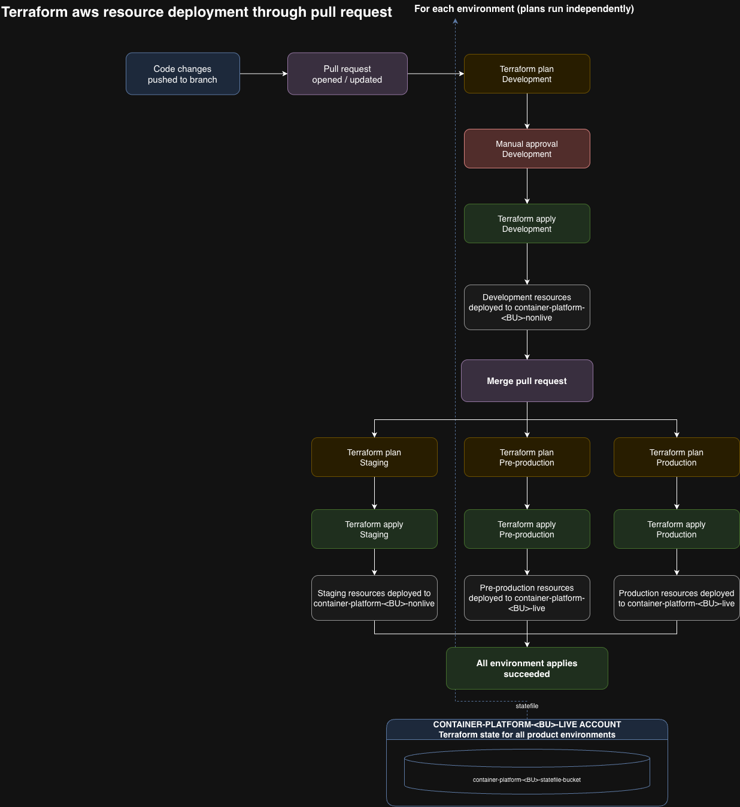

# ADR-019: User Terraform Deployment Workflow

**Status:** Proposed - draft  
**Date:** 2026-10-06  
**Decision Maker:** Cloud Platform team, subject to AWS and security agreement  
**Category:** CICD/Infrastructure

## Context

Teams define AWS resources in each product's `resources` folder in `container-platform-environments`. Each product has one or more environments, and each environment corresponds to a Kubernetes namespace. Terraform runs separately for each environment, using a workspace and the appropriate BU nonlive or live account.

The workflow needs to identify which products and environments are affected by a change, then run Terraform in the right workspace with the right account, role, state, and runner. It could use a separate workflow for each team or BU, or one shared workflow with a job matrix. A shared workflow keeps the common logic in one place, while separate workflows could help with scale or isolation if needed later. Since teams can have any number of environments with arbitrary names, the workflow should get its targets from platform-controlled configuration rather than a fixed list of jobs.

This decision covers Terraform deployment only. Argo CD continues to manage workloads and namespace baselines under [ADR-018](ADR-018-deployment-model-flexibility-gitops-vs-push-cd.md).

## Decision

Use GitHub Actions and adapt suitable Modernisation Platform patterns. Start with one platform-owned workflow that reads the affected products and environments from platform-controlled configuration, then runs a matrix of jobs. Each job applies the product's resources in the environment's workspace, using the configured account, roles, state, and runner. Targets run independently. Separate workflows for each team or BU can be considered later if the shared workflow causes problems with scale, isolation, or operations. Whether to use reusable workflows internally is an implementation detail.

Do not introduce Terraform components initially. A component is a separate infrastructure layer with its own state and deployment, such as networking followed by compute. Modernisation Platform uses this pattern for complex workloads. Container Platform will initially target more straightforward, Kubernetes-native applications, so each product environment will be treated as one deployment unit. Layered deployments also require more workflow customisation to model dependencies and determine and enforce apply order between layers. Revisit components if workload complexity requires independently managed layers.

### Deployments

- On pull requests, plan product-level resources in the affected environment workspaces.
- Allow optional nonlive applies before merge, gated by approval of the specific revision and targets. Environments that allow pre-merge deployments should indicate this in their configuration file.
- After merge, automatically create a fresh plan and apply changes to all affected product and environment workspaces in their configured accounts. Do not carry a pull-request planfile forward to apply after merge. There are no post-merge approval gates. Teams should expect merged changes to apply as soon as capacity and deployment locks allow.
- Do not order deployments across tiers or environments within a product. Each target runs independently, subject to concurrency controls. Teams that need a specific order must use separate pull requests with Terraform changes targeting only the intended environments, merging each after checking the previous deployment. For example, rolling out dev > staging > preprod > prod requires four environment-targeted pull requests. This also applies to preprod and prod environments in the live tier: one pull request affecting both will not deploy to preprod first. A priority and dependency system would be difficult to maintain when environments can have arbitrary names and each product can have any number of them.

### State and Roles

- One state bucket per BU, in that BU's live account, holding both nonlive and live state. Each Terraform folder has one backend configuration with one bucket shared by its workspaces, so the proposed workspace model cannot split nonlive and live state between account-local buckets.
- Use a Terraform workspace for each product environment (the environment corresponding to a Kubernetes namespace) to separate that environment's state.
- The workflow assumes a role scoped to the target's state. The Terraform provider assumes a separate role with permission to manage resources in the destination account.
- Nonlive jobs therefore need restricted state access in a live account, but must not receive live resource permissions.

### Concurrency and Runners

- Set each job's concurrency group from the state identity: BU, product, and environment workspace. Use the same key before and after merge so runs against one workspace are serialized, while different workspaces can run at the same time. Do not include the pull request, commit, or workflow run ID in the key, since that could let runs against the same state overlap. 
- Teams wait for their own product environments, not unrelated teams. Shared runner capacity could still cause queues.
- The 256-job matrix limit is only a concern for platform-wide changes. For those runs, follow the Modernisation Platform approach of splitting work into batches. Ordinary team-scoped runs are not expected to reach the limit.
- Prefer GitHub-hosted runners for AWS-only deployments where security and connectivity allow.
- It is not yet known whether user modules need to change Kubernetes state. If they do not, deployments will not need private runners for Kubernetes access. If they do, use private runners only for Terraform stages that need the private EKS endpoint. Other stages could use GitHub-hosted runners. Confirm whether the workflow can choose a runner for each stage, such as init, plan, or apply, based on the module, backend, and provider requirements.
- Private-runner scaling speed and maximum capacity are unknown. Other applicable GitHub Actions limits are TBC.

### Recovery and Security

- Teams can rerun failed deployments themselves. Each retry must create a fresh plan and must not let an older revision overwrite a newer deployment.
- Separate roles are not enough because Terraform can run code with the job's credentials. Enforce target isolation through IAM and state bucket policies, not just matrix selection.

## Consequences

Teams can test nonlive changes before merge and deploy without waiting for approval afterwards. Multiple pull requests applying to the same BU, product, and environment workspace share state. Concurrency controls serialize those runs, but do not resolve conflicting changes: one branch's apply can overwrite or undo another branch's changes. Teams must coordinate overlapping development and resolve conflicts on a best-efforts basis; the platform workflow will not reconcile them. Planning afresh after merge avoids applying a stale pull-request planfile, but the applied plan is not guaranteed to be identical to the one reviewed before merge.

There is no native staged rollout between environments, including environments within the same tier. Teams must manage the environment-targeted pull-request sequence themselves and ensure shared Terraform changes do not unintentionally target later environments.

Target-scoped state and concurrency avoid a single platform-wide deployment queue. Separate BU state buckets limit the state-access and recovery blast radius to a BU, but both tiers depend on that BU's live account for state. Losing access to that account or bucket would prevent Terraform operations in both tiers. Where private runners are needed, their capacity and scaling remain unproven.

## References

- [Design user resources workflow #8490](https://github.com/ministryofjustice/cloud-platform/issues/8490)
- [Enable user AWS resources #8489](https://github.com/ministryofjustice/cloud-platform/issues/8489)
- [ADR-002: GitOps Fleet Management](ADR-002-argocd-gitops-fleet-management.md)
- [Modernisation Platform environments](https://github.com/ministryofjustice/modernisation-platform-environments)
