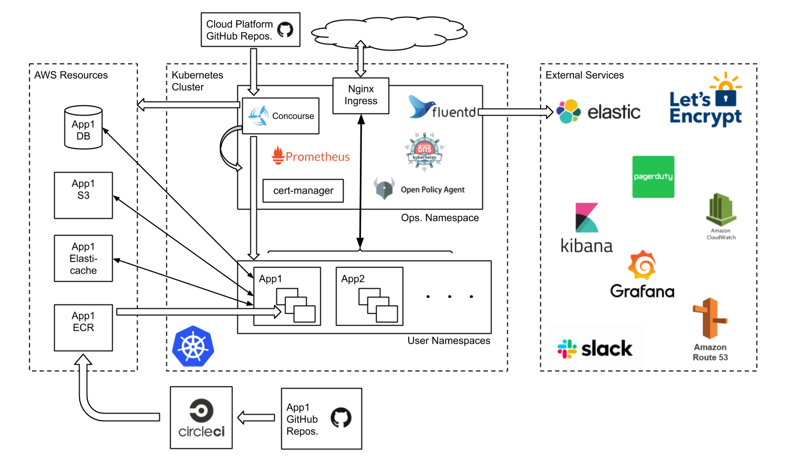

# The Cloud Platform - Architectural Overview

## Purpose
This document is to provide an overview and breakdown of the individual components of the Pipeline Architecture.

This starts with the user pushing some code to GitHub, the PipeLine Automatically detecting the new change and then processing it, which ultimately results in a resource change in AWS. This document focuses on each of these stages in detail and architecture the enables it.

## Architecture Diagram

This is a high-level overview of the components and services which comprise the Cloud Platform.

The source for this diagram is [here][Architecture Diagram]

Below is a diagram that gives an architectural overview of the pipeline process:

## Components
As seen in the diagram, there are a few different components that the architecture is comprised of.
This section will break-down these components and detail the context in which they are used.

### Concourse
Concourse is the core application of the pipeline architecture.

In terms of the architectural overview, concourse handles the following tasks:

* Watches Master branches for code changes on GitHub.
* Pulls a code change into the pipeline from GitHub.
* Applies the submitted Terraform code and makes the defined AWS resource changes.
* Notifies Slack channel of successful or failed pipeline triggers.

Concourse is hosted on the 'cloud-platform-live-0' cluster.

### Terraform
Terraform is our chosen format for defining infrastructure as code.

AWS resources are defined and maintained in Terraform files, written by developers and approved by us.

Concourse is able to interpret Terraform files and apply the changes to the relevant AWS resources.

### GitHub
GitHub is where all of our code repositories that are used by pipeline are stored.

Concourse is configured to watch the 'master' branches of our selected application repos.

The GitHub process flows as follows:
1. A developer will make a change to a Terraform file/s in one of our repos and then raise a PR.
2. A member of the Cloud Platform team will review the PR and if successful, the developer is notified.
3. The developer is now allowed to merge the code change into the 'master' branch.
4. The code change in 'master' is noticed by Concourse, and the pipeline is triggered.

### AWS
AWS is where all of our infrastructure is hosted.

AWS is the end-point of the pipeline and destination where we expect to see the resources defined in Terraform to match what we intended before it was sent through the pipeline.

### Slack Notifications
During the final stages of the pipeline process, there will come a point where Concourse will decide if the code submitted has been applied successfully, or for whatever reason, has failed.

This outcome will automatically be posted into the '#cp-build-notification' Slack channel.

This is useful information for developers and members of the Cloud Platform team.

[Architecture Diagram]: https://docs.google.com/drawings/d/1QQpTN8i2n3QZwIELTTbnxpTNy83eP0T50nVv_2aLx5g/edit?usp=sharing
