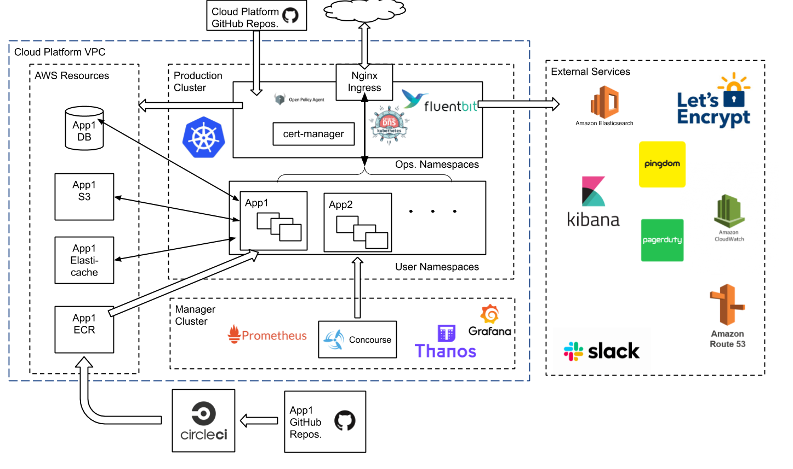
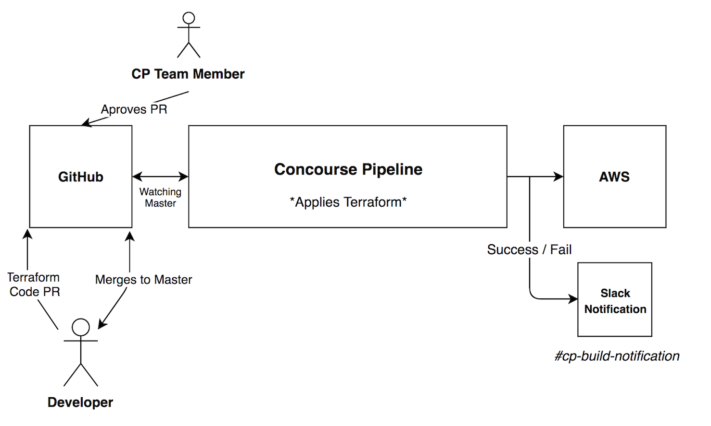

# The Cloud Platform - Architectural Overview

## Purpose

This document is to provide an overview and breakdown of the individual components of the Cloud Platform.

## Principles

### Platforms scale, ops teams don't

We want to minimize the need for any 'central web ops team', which does bespoke work, inevitably for only a handful of service teams. Instead we believe in platforms, which offer a standardized approach to hosting. A good platform includes lots of automation and a good service wrapper, to meet the common needs of scores of service teams.

Web ops people should mostly work on a platform, delivering value at scale.

### A high tide raises all boats

We embed ops tools and best practices into a platform. This increases service teams' ability to operate their services and promotes high quality engineering.

Service teams should feel the platform supports them to deliver, without being constrained.

For example in Cloud Platform we offer tools: monitoring, logging, alerts, security scanning, and best practices: Infrastructure as Code, GitOps.

### Self service

Providing service teams with the ability to get started with minimal friction means minimizing waiting for humans to decide or provide. Self-service encourages users if they just want to try things out, to spin something up to test a theory, a different config or different infrastructure.

Self-service requires good documentation, automated processes, and maintaining sufficient oversight.

### Cattle not pets

Apps are cattle. When a service team hosts its software on Cloud Platform, it needs to accept it will be treated like cattle not pets. The containers/pods will be herded between server nodes for lots of reasons, such as nodes being drained due to a planned recycling schedule, or due to failures. This approach is great for scaling, efficiency and high availability (HA). But it needs the software containers to be designed as a [12 Factor App](https://12factor.net/) and data/state held in cloud storage.

Infrastructure is cattle. Cloud Platform team should use a 'delete and replace' process to perform upgrades, fix problems and disaster recovery.

Clusters are cattle. We can't have one cluster, vulnerable to a fault, YOLO changes and upgrades. Clusters need to be disposible. Replacement is automatic and seamless.

### Constant reinvention

As hosting technology and ideas change and improve, we will relentlessly reinvent all aspects of the platform to serve user needs better. We shall not be afraid to replace the whole platform, if that serves users best. A strong Cloud Platform team has more

MOJ from made the leap from Template Deploy to Cloud Platform, with a lengthy transition, but provided a step change in benefits - see [Comparison with Template Deploy](#comparison-with-template-deploy).

## Comparison with Template Deploy

Template Deploy was MoJ's hosting solution prior to Cloud Platform. It was based on virtual machines (VMs), which was efficient and flexible for its day, but when container technology emerged it showed a lot of advantages.

Containers allow MoJ to write apps that use a microservice architecture, which can help with staying agile with larger services, according to our [Architecture Principles](https://docs.google.com/document/d/1XBTuCw0y--4fZpHcTLWilSFx_qz3aewTiWYJGTZU4sA/edit#). Development with several containers is much more feasible than running multiple VMs on a local machine. Containers are also quick to start, which supports microservices patterns of auto-scaling quickly and frequently deploys.

Containers are also more efficient. The size of a VM is fixed at the moment you create an image or rent it, whereas containers share a machines' CPU and memory. And of course VMs have the additional overhead of running the kernel per instance, costing machine time while it boots, and the enduring memory footprint.

For more about the choice of Kubernetes for orchestration see: [ADR004 Use kubernetes for running containerised applications](/architecture-decision-record/004-use-kubernetes-for-container-management.md)

## Pipeline architecture

The 'pipeline' is the key part of Cloud Platform that deploys the Kubernetes and AWS resources, that a service team has defined.

The process starts with the user pushing some code to GitHub. The pipeline automatically detects the new change and then processes it. This ultimately results in a resource change in Kubernetes/AWS. This document focuses on each of these stages in detail and the architecture that enables it.

## Architecture Diagram

This is a high-level overview of the components and services which comprise the Cloud Platform.

The source for this diagram is [here][Architecture Diagram]

Below is a diagram that gives an architectural overview of the pipeline process:

## Components

As seen in the diagram, there are a few different components that the architecture is comprised of.
This section will break-down these components and detail the context in which they are used.

### Concourse

Concourse is the core application of the pipeline architecture.

In terms of the architectural overview, concourse handles the following tasks:

* Watches Master branches for code changes on GitHub.
* Pulls a code change into the pipeline from GitHub.
* Applies the submitted Terraform code and makes the defined AWS resource changes.
* Notifies Slack channel of successful or failed pipeline triggers.

Concourse is hosted on the 'cloud-platform-live-0' cluster.

### Terraform

Terraform is our chosen format for defining infrastructure as code.

AWS resources are defined and maintained in Terraform files, written by developers and approved by the Cloud Platform team.

Concourse is able to interpret Terraform files and apply the changes to the relevant AWS resources.

### GitHub

GitHub is where all of our code repositories that are used by pipeline are stored.

Concourse is configured to watch the 'master' branches of our selected application repos.

The GitHub process flows as follows:

1. A developer will make a change to a Terraform file/s in one of our repos and then raise a PR.
2. A member of the Cloud Platform team will review the PR and if successful, the developer is notified.
3. The developer is now allowed to merge the code change into the 'master' branch.
4. The code change in 'master' is noticed by Concourse, and the pipeline is triggered.

### AWS

AWS is where all of our infrastructure is hosted.

AWS is the end-point of the pipeline and destination where we expect to see the resources defined in Terraform to match what we intended before it was sent through the pipeline.

### Slack Notifications

During the final stages of the pipeline process, there will come a point where Concourse will decide if the code submitted has been applied successfully, or for whatever reason, has failed.

This outcome will automatically be posted into the '#cp-build-notification' Slack channel.

This is useful information for developers and members of the Cloud Platform team.

[Architecture Diagram]: https://docs.google.com/drawings/d/1QQpTN8i2n3QZwIELTTbnxpTNy83eP0T50nVv_2aLx5g/edit?usp=sharing
